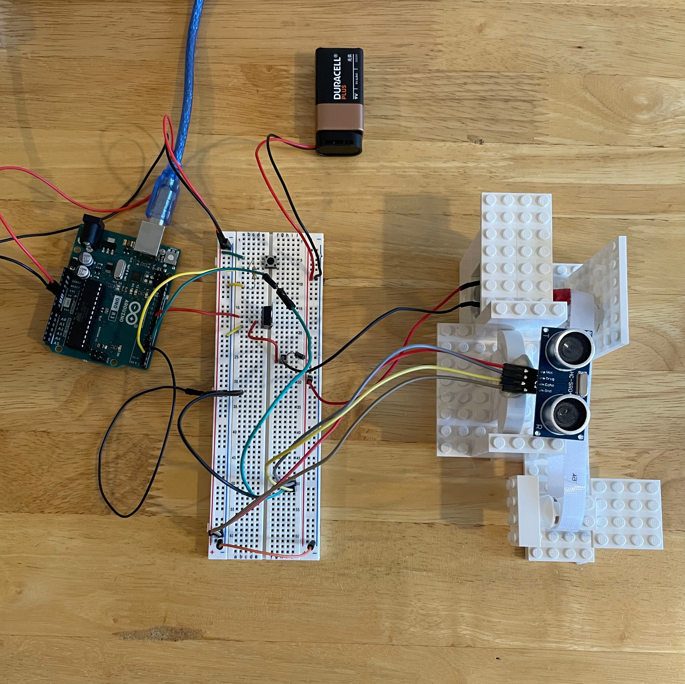
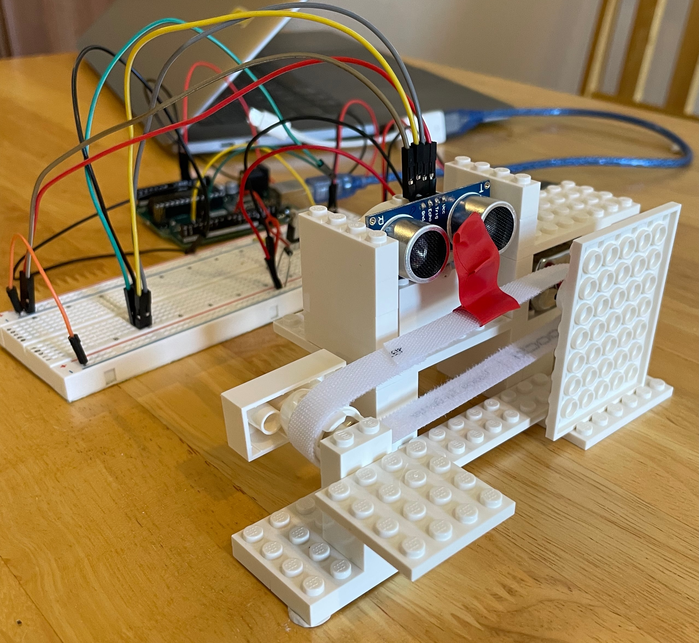

# arduino-conveyor-belt

Challenge Lab Project to build a simple conveyor belt system.

## The Brief

Develop a working hardware model of a conveyer belt system which counts physical items.  
It will work as follows:  
Imagine a set of boxes moving on a conveyer belt.  
Your task is to count these boxes using an Arduino HC_SR04 ultrasound sensor wired to your Arduino kit as they go past the sensor.  
The conveyor belt will stop after counting 3 or 6 boxes, depending on a selector switch.  

## Circuit Modifications

The circuit follows the setup outlined in Project 9 of the Arduino Project Book, with the inclusion of the SR04 Ultrasonic Sensor.
You can see this in the following top down photo.

## Code Modifications

Extensive changes were made to the code provided in Project 9 to accommodate the addition of the ultrasonic sensor and address issues with excessive detections. The main changes were:

* Use of the NewPing library to manage ultrasonic sensor readings
* Implementation of time intervals to reduce the frequency of sensor readings
* Addition of serial logging for debugging purposes

## Conveyor Belt Experiment

I didn't need to actaully build a conveyer belt as part of the brief, we were allowed to pass a phone over the sensor three times, etc to simulate the conveyer belt moving.  
But I decided to attempt to create a conveyor belt system using LEGO components, tape, and a Velcro strip.  
The objective was to detect the passage of tape segments along the conveyor belt.  

Challenges were encountered, particularly in controlling the speed of the motor.  
The motor's speed was difficult to adjust, resulting in inconsistent tape detection due to excessive speed.  
It did work but wasn't very consistent.  

Regardless below is a picture of this set up:  

